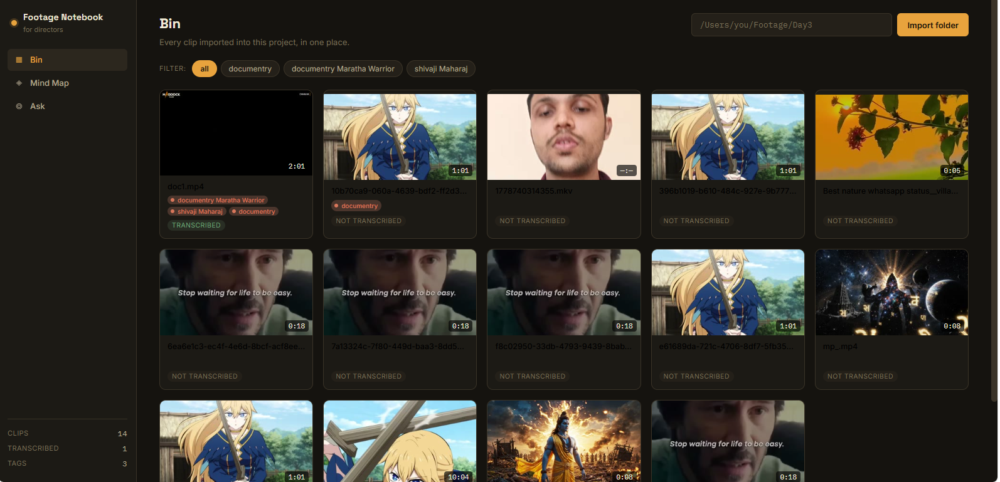
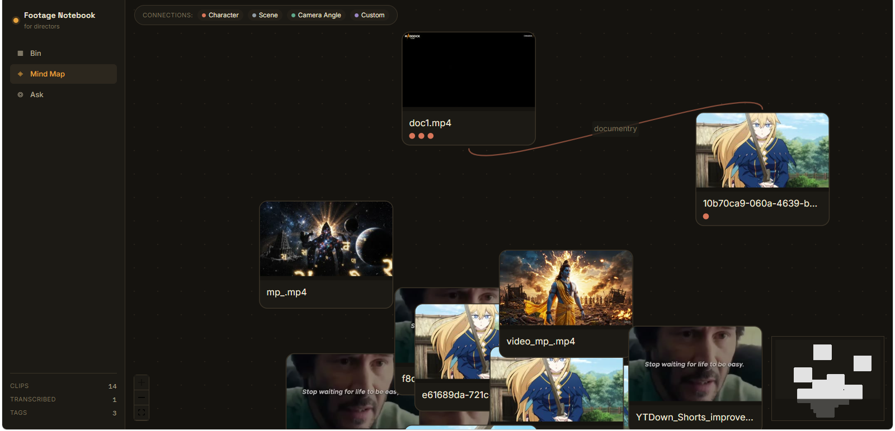
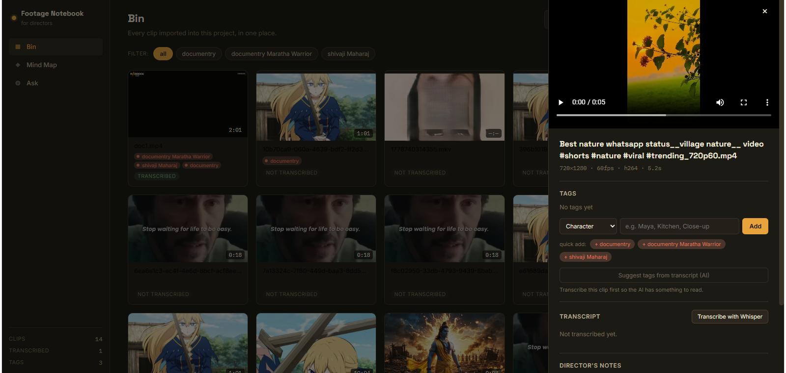
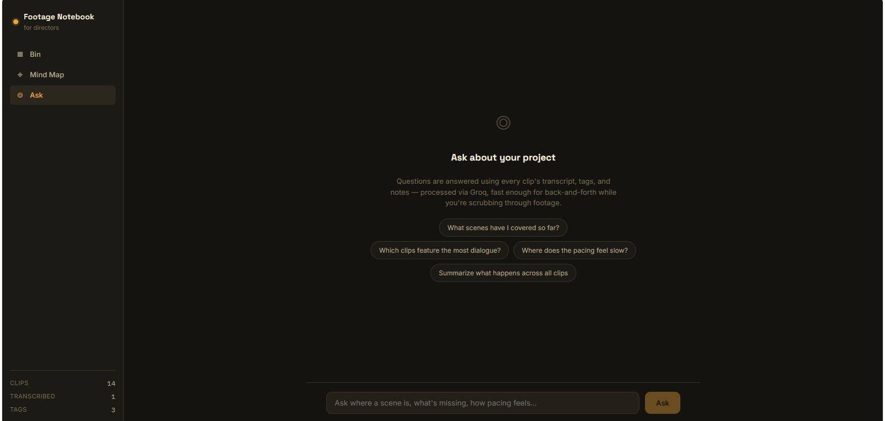
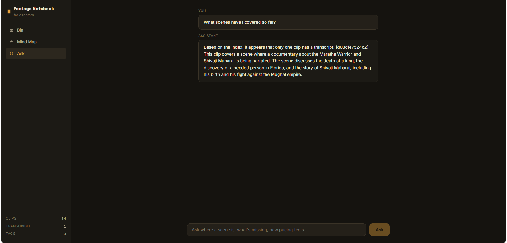

# Director's Footage Notebook

A local-first tool for organizing raw footage by story, character, and camera
angle — with automatic transcription and an AI assistant you can ask things
like "where's the scene where Maya finds the letter" or "where does the
pacing feel slow."

Everything runs on your own machine. Your footage never gets uploaded
anywhere; the only thing that leaves your computer is transcript *text*, and
only when you use the Ask feature (sent to Groq's API to generate an answer).

---


---

---

---

---

---
## What's actually built (v1 / Phase 1–5 spine)

- **Import** a folder of clips by path — files stay where they are, nothing
  gets copied.
- **Metadata + thumbnails** pulled automatically via ffmpeg/ffprobe (duration,
  resolution, fps, codec).
- **Transcription** of each clip's dialogue using local Whisper
  (`faster-whisper`) — no API key needed for this part, runs entirely on
  your machine.
- **Tagging** by character, scene, camera angle, or custom label, each with
  its own consistent color used everywhere in the app.
- **AI tag suggestions** (optional) — once a clip is transcribed, you can ask
  Groq to suggest likely characters/scene name as a starting point; you
  still apply or ignore it.
- **Mind map view** — every clip is a node; clips that share a tag (same
  scene, same character, same camera angle) get connected automatically.
  Built with React Flow.
- **Ask view** — a chat interface backed by Groq that answers questions using
  every clip's transcript + tags + your notes as context, and links straight
  back to the relevant clip(s).
- **Director's notes** — a free-text field per clip for anything you want to
  remember about a take.

## What's intentionally *not* built yet

- **Automatic camera-angle / character detection from the video itself.**
  No model reliably does this out of the box. You tag manually (fast, with
  color-coded quick-add), and the AI-suggestion feature gives a rough
  starting guess from dialogue only, not visual analysis.
- **Drag-to-reposition mind map layout persistence.** Nodes auto-arrange by
  shared scene tag each time you open the view; manual repositioning isn't
  saved between sessions yet.
- **Multi-project support.** Right now there's one shared bin (one SQLite
  database). Good enough for a single project/shoot; ask if you want
  per-project switching added.

---

## Requirements

You'll need three things installed on your machine before this runs:

1. **Python 3.10+**
2. **Node.js 18+** (for the frontend)
3. **ffmpeg** — required for metadata, thumbnails, and audio extraction.
   - macOS: `brew install ffmpeg`
   - Windows: download from [ffmpeg.org](https://ffmpeg.org/download.html)
     and add the `bin` folder to your PATH
   - Linux: `sudo apt install ffmpeg`

   Check it worked: `ffmpeg -version` in your terminal should print a version,
   not "command not found."

You'll also want a **free Groq API key** for the Ask feature and AI tag
suggestions (transcription itself does *not* need this — that part is fully
local). Get one at [console.groq.com/keys](https://console.groq.com/keys).
The app works fine without a key; you just won't be able to use Ask.

---

## Setup

### 1. Backend

```bash
cd backend
python3 -m venv venv
source venv/bin/activate        # Windows: venv\Scripts\activate
pip install -r requirements.txt

cp .env.example .env
# open .env and paste your Groq API key in:
#   GROQ_API_KEY=gsk_your_key_here

uvicorn app.main:app --reload
```

The backend will start at `http://localhost:8000`. Leave this terminal
running.

The first time you transcribe a clip, `faster-whisper` will download its
model (a few hundred MB for the default "base" size) — this happens once and
is then cached.

### 2. Frontend

In a **new** terminal:

```bash
cd frontend
npm install
npm run dev
```

Open `http://localhost:5173` in your browser. That's the app.

---

## Using it

1. Go to the **Bin** tab, paste the full path to a folder of footage (e.g.
   `/Users/you/Footage/Day3`), click **Import folder**.
2. Click **Read metadata for all** to pull durations/thumbnails.
3. Click into any clip to open its detail panel: transcribe it, tag it by
   character/scene/camera angle, jot notes. Clicking a transcript line jumps
   the video to that timestamp.
4. Switch to **Mind Map** to see clips connected by shared tags.
5. Switch to **Ask** and ask questions about your footage in plain language.

## Project structure

```
backend/
  app/
    main.py            FastAPI app + router wiring
    models.py           Clip / Tag / Transcript database models
    database.py          SQLite setup
    config.py            Settings (Groq key, Whisper model size)
    routers/
      clips.py            import, metadata, thumbnails, video streaming
      transcription.py    Whisper transcription
      tags.py              tag CRUD + assignment + AI suggestions
      mindmap.py           graph computation (nodes/edges from shared tags)
      chat.py               Groq-powered Q&A over the project
    services/
      video_meta.py        ffmpeg/ffprobe wrappers
      transcription.py     faster-whisper wrapper
      ai_chat.py           Groq prompt construction
  storage/
    clips/                 (currently unused - clips stay at their original path)
    thumbnails/            generated thumbnail JPEGs
    db/                     SQLite database file

frontend/
  src/
    App.jsx                 top-level shell + view switching
    components/
      BinView.jsx            clip grid + import + filtering
      ClipDetailDrawer.jsx   video / transcript / tags / notes panel
      MindMapView.jsx         React Flow graph
      ChatView.jsx            Ask interface
      TagPill.jsx             shared color-coded tag chip
    lib/api.js                backend API client
    styles/                   design tokens + per-view CSS
```

## Troubleshooting

**"ffmpeg/ffprobe not found on PATH"** — install ffmpeg (see Requirements
above) and restart the backend.

**Transcription is slow** — the default Whisper model (`base`) is tuned for
speed over accuracy. For better accuracy at the cost of speed, edit
`backend/.env`: `WHISPER_MODEL_SIZE=small` or `medium`. If you have an NVIDIA
GPU with CUDA set up, set `WHISPER_DEVICE=cuda` for a large speedup.

**"No Groq API key configured"** — add `GROQ_API_KEY` to `backend/.env` and
restart the backend.

**Imported clips show no thumbnail** — click "Read metadata for all" in the
Bin view; thumbnails generate as part of that step, not at import time.
